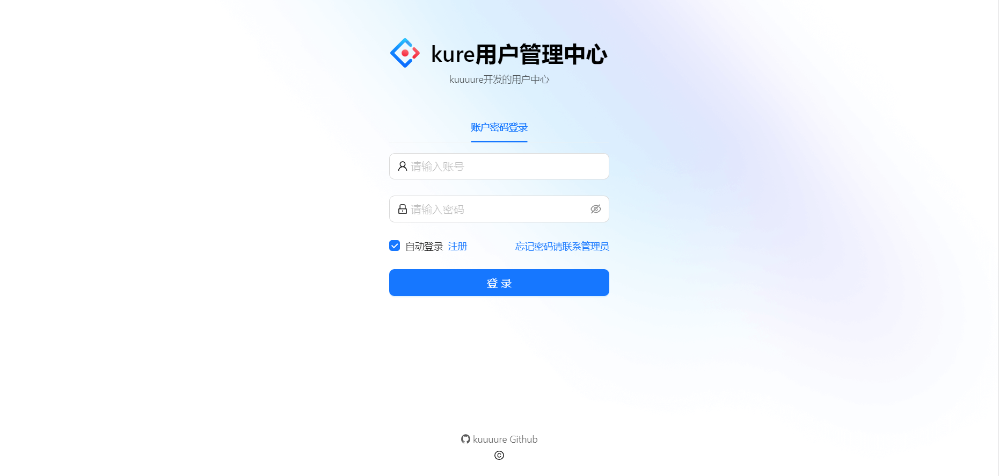
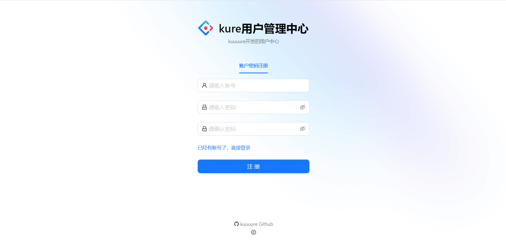
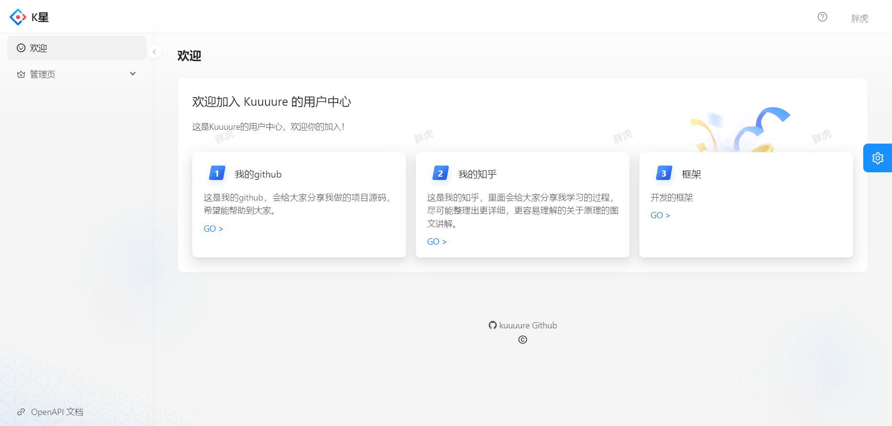
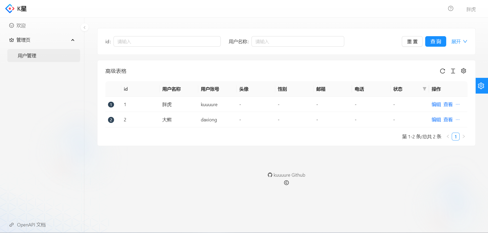

# 用户中心项目

注意：该仓库仅为项目的前端部分，后端部分放置在本人另一个仓库。

## 项目介绍
该项目意在下搭建一个**用户中心——即允许用户注册，登录，修改在系统上的信息等**。
创建该项目有两个目的：
* 作为一个提供练习的项目，能够学习到整个项目搭建的流程，以及学习如何部署上线
* 搭建一个用户中心，这个用户中心可以作为其他项目比如常见的博客，论坛，转手平台的统一用户中心。

## 技术栈
* 前端：`React`，`Ant Design`，`Umi`，`Ant Design Pro`
* 后端：`Spring Boot`
* 数据库：`Mybatis`，`Mybatis-plus`

## 效果展示

